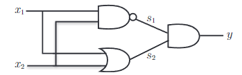

# 感知机

## 1. 感知机模型  


## 2. 感知机算法

### 2.1 训练过程

训练过程就是不断调整权重，使得感知机模型能够正确分类训练数据。具体地，在训练过程中，每一次迭代，都需要对每个训练样本进行如下操作：

$$\lim_{t \rightarrow \infty} \text{min}_w \sum_{i=1}^N (y_i - \text{sgn}(w^T x_i + b))^2$$

1. 计算输入向量与权重的点积，并加上偏置项$b$，得到预测值$y$。  
   1. $y = \text{sgn}(w^T x + b)$
   2. $\text{sgn}(x) = \begin{cases} 1, x \geq 0 \\ -1, x < 0 \end{cases}$
   3. $w^T x$表示输入向量与权重的点积。
   4. $b$表示偏置项。
   5. 注意：$x_0$表示偏置项，$x_0$的值为1。
2. 根据预测值$y$和真实值$t$，计算误差$e$。
3. 根据误差$e$更新权重$w$。
4. 重复步骤1-3，直到所有训练样本的误差都为0。
### 2.2 预测过程

预测过程就是利用训练好的感知机模型对新的输入向量进行分类。具体地，在预测过程中，只需要计算输入向量与权重的点积，并加上偏置项$b$，得到预测值$y$。

$$y = \text{sgn}(w^T x + b)$$

其中$w^T x$表示输入向量与权重的点积，$b$表示偏置项。

### 2.3 算法流程

训练过程：

1. 输入训练数据$X$和$y$。
2. 初始化权重$w$和偏置项$b$。
3. 重复以下步骤，直到所有训练样本的误差都为0：
   1. 对于每个训练样本$(x_i, y_i)$：
      1. 计算预测值$y_i = \text{sgn}(w^T x_i + b)$。
      2. 根据预测值$y_i$和真实值$y_i$，计算误差$e_i = y_i - y_i$。
      3. 更新权重$w$：$w = w + \eta e_i x_i$。
      4. 更新偏置项$b$：$b = b + \eta e_i$。

预测过程：

1. 输入测试数据$X$。
2. 对于每个测试样本$x_i$：
   1. 计算预测值$y_i = \text{sgn}(w^T x_i + b)$。
   2. 输出预测值$y_i$。

$x_i \cdot w_j + b = \sum_{i=1}^n x_i w_i + b$
其中$x_i$为输入向量，$w_j$为权重，$b$为偏置项。$w_0$为偏置项，$w_0$的值为1
 
### 2.4 算法实现

```python
import numpy as np

class Perceptron:
    def __init__(self, input_size, lr=0.1):
        self.input_size = input_size
        self.lr = lr
        self.weights = np.zeros(input_size + 1)

    def activation_function(self, x):
        return np.where(x >= 0, 1, 0)

    def fit(self, X, y, epochs=100):
        for epoch in range(epochs):
            for (x, target) in zip(X, y):                
                # Forward pass
                x = np.append(x, 1) # adding bias
                output = self.activation_function(np.dot(x, self.weights))
                # Backward pass
                error = target - output
                self.weights += self.lr * error * x

    def predict(self, X):
        X = np.append(X, np.ones((X.shape[0], 1)), axis=1)
        return self.activation_function(np.dot(X, self.weights))
``` 